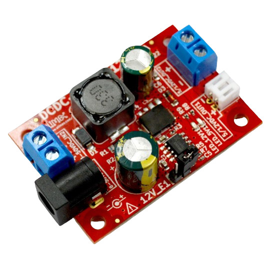

# DCDC-50-5-12
Industrial grade -40+85C power supply module for OLinuXino. Suitrable also for 12 and 24V car battery systems.

## Features

* Input voltage 8-50VDC
* Output voltage 5V/1.5A or 12V/1.5A
* Dimensions: 50x35x15mm

## Licenses

* Hardware is released under CERN Open Hardware Licence Version 2 - Strongly Reciprocal, all silkscreen credits to Olimex should remain;
* Software is released under GPL3 Licensee
* Documentation is released under CC BY-SA 4.0